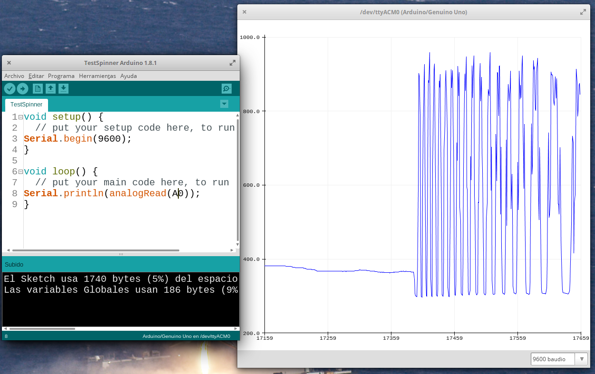
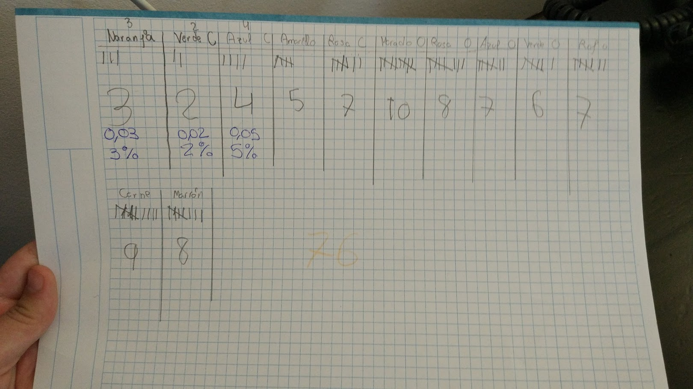

# Física y arduino con Spinners

Ya tenemos claro que a los chavales les gusta ¿por qué no usarlo para que aprendan?

* Los diseñan
* Los construyen
* Aprenden:
  * Física:
    * Rozamiento
    * Momento de inercia
  * Diseño 3D
  * Mecánica
  * A emprender
    * Presupuestos
    * Relaciones comerciales
    * Estimar el tiempo
* Competiciones
  * Medida de velocidad y duración con Arduino: Tacómetro
    * Sensores para medir la rotación
    * Interrupciones hardware
    * Medida de tiempos
    * Cálculo de velocidades angulares

## Funcionamiento

[Video Comparativa rendimiento rodamiento cerámico (2$) con uno metálico (0,20$)](https://www.youtube.com/watch?v=vLL-T4Z_TNo)

## Diseños

[Spinners con tuercas M8,10,m12](http://www.thingiverse.com/thing:2078940)

[Spinner con 3 tuercas M10](http://www.thingiverse.com/thing:2032459)

(tarda 1 hora a 0.3)

[otros diseños de spinners con tuercas](http://www.thingiverse.com/search?q=spinner+nuts&sa=)

[Spinner con leds](http://www.thingiverse.com/thing:2245883)

## Compras

[100 tuercas M10por 22€](https://www.youtube.com/watch?v=vLL-T4Z_TNo)

[100 rodamientos 608zz por 36€](https://es.aliexpress.com/store/product/608zz-Axial-Ball-Bearing-8mm-skate-bearings-8x22x7-Double-Shielded-100-pieces/722545_32588807551.html)

[10 rodamientos 608zz por 2,5€](https://es.aliexpress.com/item/10pcs-608ZZ-8x22x7-3D-printer-Miniature-Radial-Bearings-Deep-Groove-Ball-Bearings-Skateboard-Scooter-Roller-Wheels/32768021718.html)

[20 rodamientos 608zz Abec9 (sin freno) unos 15€](https://es.aliexpress.com/wholesale?ltype=wholesale&d=y&origin=y&isViewCP=y&catId=0&initiative_id=SB_20170514112051&SearchText=abec9+20pcs&blanktest=0&tc=af)

## Construcción

### Limpieza

[limpieza](https://www.youtube.com/watch?v=mpz3_pZ9Ay0)

## Medidas

### Medida de la rotación con un osciloscopio

[F. Malpartida](https://plus.google.com/u/0/115838143115912805344) ha utilizado un [osciloscopio y  un sensor óptico para ver el giro](https://plus.google.com/u/0/115838143115912805344/posts/DAK4Hzwv4wq)

[Diseño del banco de trabajo](http://www.thingiverse.com/thing:2319223)

También propone usar un sensor inductivo

### Medida de rotación con Arduino

El montaje es muy sencillo: un sensor de luz conectado al pin analógico A0

[Diseño del banco de pruebas](./modelos/Test_bench_v1.03.stl)

#### Código superSimplificado

    void setup() {
      Serial.begin(9600);
    }

    void loop() {
      Serial.println(analogRead(A0));
    }

[Test v0.1](./codigo/TestSpinner_v0.1.ino)

#### Código con cálculo de derivada

    #define PIN_SENSOR_OPTICO A0
    #define PIN_POTENCIOMETRO_UMBRAL_MAX A3
    #define PIN_POTENCIOMETRO_UMBRAL_MIN A2

    #define PIN_LED 13

    void setup() {
      Serial.begin(115200);
      pinMode(PIN_LED,OUTPUT);
    }

    int old_valorSensor=0;

    void loop() {
      int valorSensor=analogRead(PIN_SENSOR_OPTICO);
      int diffSensor=valorSensor-old_valorSensor; // Calculamos la diferencia con el valor anterior
      old_valorSensor=valorSensor;

    // Usamos dos potenciometros analogicos para ajustar el umbral mínimo y máximo
      int valorPotUmbralMax=analogRead(PIN_POTENCIOMETRO_UMBRAL_MAX);
      int valorPotUmbralMin=analogRead(PIN_POTENCIOMETRO_UMBRAL_MIN);

      Serial.println(String(valorPotUmbralMin)+
          ", "+String(valorSensor)+
          ", "+String(diffSensor)+
          ", "+String(valorPotUmbralMax));

      // activamos el led cuando el valor esté entre los umbrales
      if((valorSensor>valorPotUmbralMax) && (valorSensor<valorPotUmbralMin))
      { digitalWrite(PIN_LED,HIGH);}
      else
      { digitalWrite(PIN_LED,LOW);}
    }

### Practicas a realizar

* "Carreras" de spinners:
  * Cuál dura más tiempo girando
  * Cuál adquier mayor velocidad
* Construcción
  * A partir de diseños ya hechos
  * Crear diseños para maximizar la inercia, la velocidad...
* Montaje del banco de medida
* Estudio de la física del movimiento

## Dibujando los datos

[python y matlib](http://www.toptechboy.com/tutorial/python-with-arduino-lesson-11-plotting-and-graphing-live-data-from-arduino-with-matplotlib/)

[plotting arduino data](http://www.chemie.unibas.ch/~hauser/open-source-lab/instrumentino/index.html)

[python & arduino](https://playground.arduino.cc/Interfacing/Python)

[plotCat](https://pypi.python.org/pypi/plotcat/1.0.0)

[python plot serial data](http://rwsarduino.blogspot.com.es/2014/12/python-plots-from-serial-input.html)

## Trabajando la probabilidad con spinners

Se trata de medir la probabilidad de que el spinner termine apuntando dentro de una de las zonas y luego comparar las frecuencias medidas con las probabilidades esperadas

## Referencias

[La física de los spinners](http://interestingengineering.com/the-physics-of-fidget-spinners)

[Spinner POV RGB: lightino ](http://www.microsiervos.com/archivo/hackers/lightino-fidget-spinner-programable.html)

[How long a Spinner spins](https://www.wired.com/2017/05/the-phyiscs-of-fidget-spinners/) (thanks @ikkaro)

[Physics of a spinner](https://www.wired.com/2017/05/physics-of-a-fidget-spinner)

[Vídeo de impresión 3D de spinners](https://www.youtube.com/watch?v=huC4JagKYh8)

[Tutorial de limpieza de rodamientos para spinners](http://www.instructables.com/id/Speed-Tuning-Spinner-Bearings)

[Video: robot que lanza hace girar un spinner](https://www.youtube.com/watch?v=F-r3e8R0_eA)

[Vídeo: Diseñando un spinner I](https://www.youtube.com/watch?v=NX9t-JnkXU8)
[Vídeo: Diseñando un spinner II](https://www.youtube.com/watch?v=DdUQ85Srtdk&spfreload=5#t=5.727062)

[Spinner e imanes](https://www.youtube.com/watch?v=rNQCFBEHxms)

[Cómo hacer estallar un spinner](https://mientrasenfisicas.wordpress.com/2017/06/14/como-volar-en-pedazos-cualquier-spinner/)

[Enseñando STEAM con Spinners](http://hackaday.com/2017/06/23/teaching-steam-with-fidget-spinners/)

[Los 25 mejores diseños de spinners ](http://www.3ders.org/articles/20170622-25-best-and-free-fidget-spinner-toys-to-3d-print.html)

[Spinner digital, imitando con spinner con Circuit Playground de @adafruit](https://learn.adafruit.com/digital-fidget-spinner?view=all)

### Cuentarevoluciones-tacómetros

[Midiendo la velocidad de un spinner con BBC:Microbit](https://blog.adafruit.com/2017/05/31/detecting-fidget-spinner-speeds-with-a-ldr-and-the-microbit/)

[Midiendo la velocidad de giro de un spinner con BBC:Microbit ](https://blog.adafruit.com/2017/05/31/detecting-fidget-spinner-speeds-with-a-ldr-and-the-microbit/)

[Cuenta revoluciones con arduino](http://www.taringa.net/posts/hazlo-tu-mismo/19509322/Arduino---Construye-un-contador-de-revoluciones.html)

[Vídeo: Cuentarevoluciones con Circuit Playground](https://www.youtube.com/watch?v=v-PVGTwXKFU) [Código](https://github.com/adafruit/Adafruit_CircuitPlayground/blob/master/examples/tachometer_led_display/tachometer_led_display.ino) [Mi versión](https://github.com/javacasm/Spinners/blob/master/codigo/tacometro_playground/tacometro_playground.ino)

[POV spinner](http://www.instructables.com/id/POV-Arduino-Fidget-Spinner)
